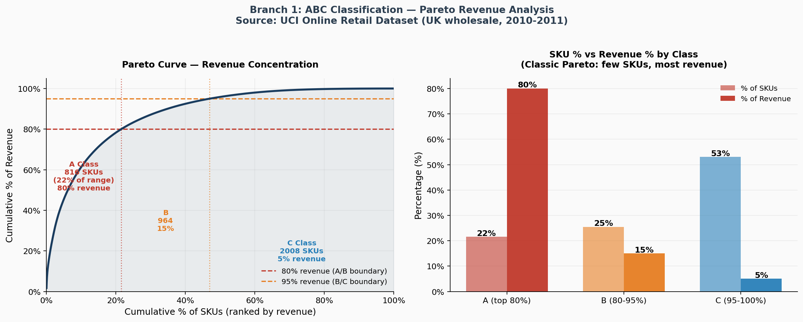
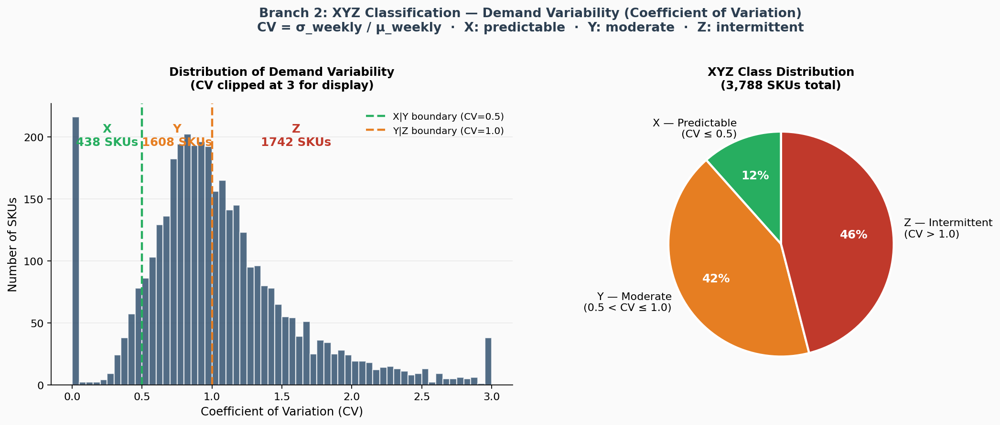
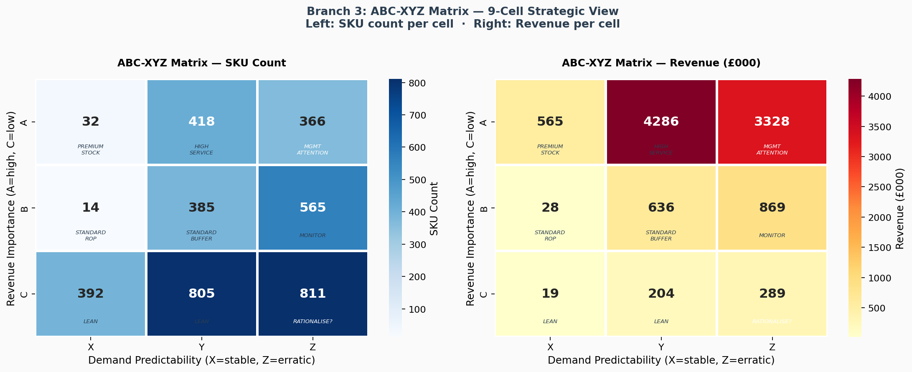
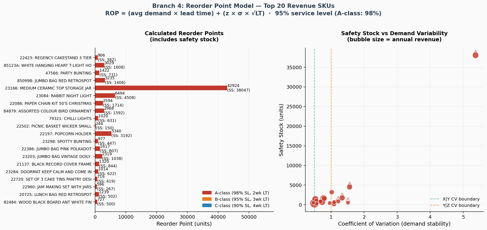
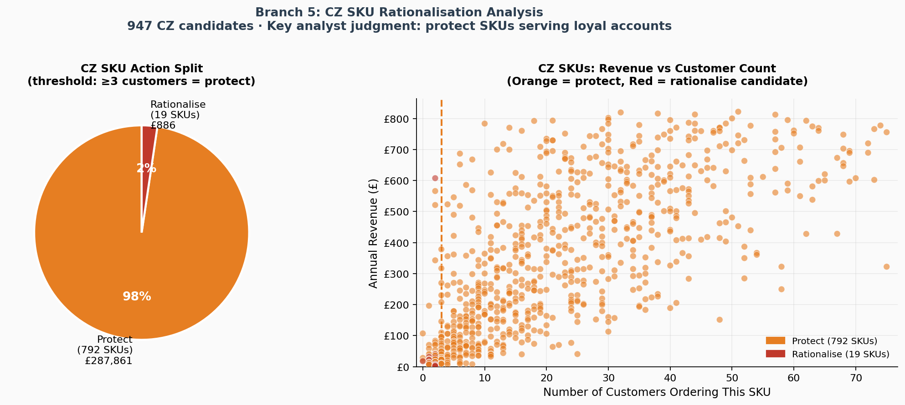
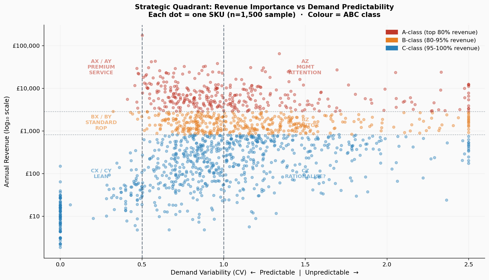

# Inventory Optimisation — UK Wholesale Distributor (1,400+ SKUs)

**Sector:** Wholesale · B2B &nbsp;|&nbsp; **Dataset:** UCI Online Retail (real, public) &nbsp;|&nbsp; **Tools:** Python · SQL · Excel

---

## Dataset

**UCI Online Retail Dataset** — real transactional data from a UK-based non-store online retailer selling giftware, primarily to wholesale customers.

- **525,462** clean invoice line items (after removing cancellations, invalid records)
- **3,788** active SKUs
- **Period:** December 2010 – December 2011 (12 months)
- **Revenue:** £10.2M across the period
- **Source:** [archive.ics.uci.edu/dataset/352/online+retail](https://archive.ics.uci.edu/dataset/352/online+retail)
- **Citation:** Chen, Sain & Guo (2012). *Journal of Database Marketing and Customer Strategy Management*, 19(3).

---

## The Brief

A UK wholesale distributor with 3,700+ active SKUs was tying up capital in slow-moving stock while simultaneously stocking out on fast movers. The problem: no systematic framework for deciding how much inventory to hold per SKU, and no principled way to identify which SKUs to rationalise.

This project applies the ABC-XYZ inventory classification framework to the full SKU range, builds a statistical reorder point model for the top 80 revenue SKUs, and identifies CZ rationalisation candidates — with an explicit analyst judgment layer to protect loyal account relationships.

---

## Analytical Framework (McKinsey Issue Tree)

**Root question:** How should a wholesale distributor with 3,700+ active SKUs prioritise inventory investment and rationalise its range?

| Branch | Method | Finding |
|---|---|---|
| 1 — ABC Classification | Pareto by revenue cumulative % | 816 SKUs (22%) drive 80% of £10.2M revenue |
| 2 — XYZ Classification | Coefficient of Variation (weekly demand) | 46% of SKUs are Z-class (CV > 1.0) |
| 3 — ABC-XYZ Matrix | 9-cell combined strategy matrix | Each cell receives a differentiated management action |
| 4 — Reorder Point Model | ROP = μLT + z·σ·√LT | Top 80 SKUs modelled at 95–98% service level |
| 5 — Rationalisation | CZ SKU review with loyalty flag | 19 true rationalise candidates; 756 protect; 136 single-event |

---

## Key Findings

### Finding 1 — Classic Pareto holds strongly
816 A-class SKUs (22% of the range) drive 80% of £10.2M annual revenue. Inventory investment should be heavily concentrated here with premium service levels (98%) and weekly management review.

### Finding 2 — Demand is predominantly variable (Z-class dominates)
1,742 SKUs (46%) have a Coefficient of Variation > 1.0 — meaning their weekly demand varies more than their mean. This is typical for seasonal giftware wholesale. Pure statistical forecasting will systematically over- or under-stock these items. Demand sensing and customer collaboration are the correct approaches.

### Finding 3 — AZ+BZ represents 931 high-value, unpredictable SKUs
£4.2M in annual revenue sits in SKUs that are economically important but demand-unstable. Safety stock alone is insufficient here. Lead-time reduction, vendor-managed inventory, and collaborative forecasting with key accounts are the recommended interventions.

### Finding 4 — CZ rationalisation: most candidates are protected by loyal accounts
Of 811 CZ SKUs, only **19 are true rationalisation candidates** (£886 total revenue — trivial). The majority have repeat purchase patterns (>3 invoices or >2 customers) and should be protected. The analyst judgment layer matters more than the algorithm here.

---

## The Hardest Question

> *"ABC-XYZ is a standard framework. Where was the original thinking?"*

The framework is standard. The judgment calls aren't.

The 19 CZ SKUs are easy. The interesting question is what to do with the 136 "single-event" items — one-off bulk orders that by definition look like Z-class but might represent a new customer trial or seasonal spike. Auto-discontinuing those would be analytically defensible and commercially irresponsible.

The reorder point model also flags 22 of the top 80 SKUs as stockout risks (CV > 1.2). Knowing which of your highest-revenue SKUs are also the most demand-volatile — that's the insight that drives where operations puts its attention next week.

---

## Reorder Point Formula

```
ROP = (μ_weekly × LT) + (z × σ_weekly × √LT)

Where:
  μ_weekly  = average weekly demand (from 12 months of transactions)
  σ_weekly  = standard deviation of weekly demand
  LT        = supplier lead time in weeks (A: 2wk, B: 3wk, C: 4wk)
  z         = z-score for target service level (A: 2.054=98%, B: 1.645=95%, C: 1.281=90%)
```

---

## Honest Limitations

- **No stock-on-hand data** — ROP gives the trigger point; live ERP stock must be compared against it
- **Demand normality assumed** — Z-class items frequently violate this; safety stock may need empirical percentile adjustment
- **Lead time variability not modelled** — If supplier reliability is poor, add: SS = z × √(LT × σ_d² + μ_d² × σ_LT²)
- **Single-year data** — Annual averages understate Q4 for seasonal giftware; ROP should be seasonally adjusted in production

---

## Repository Structure

```
p4-inventory-optimisation/
├── README.md
├── analysis.py              # Full 5-branch pipeline: ABC, XYZ, ROP, rationalisation, 6 charts
├── build_excel.py           # 7-sheet professional workbook builder
├── data/
│   └── OnlineRetail.csv     # UCI Online Retail dataset (real, public)
├── outputs/
│   ├── sku_master.csv       # 3,788 SKUs with ABC, XYZ, ABC_XYZ, CV, revenue
│   ├── abc_xyz_matrix.csv   # 9-cell matrix: count and revenue per cell
│   ├── reorder_points.csv   # ROP model for top 80 SKUs
│   ├── rationalisation_list.csv  # All 811 CZ SKUs with action flag
│   ├── summary_stats.csv    # Key findings summary
│   └── Inventory_Optimisation_VaishnaviBhor.xlsx   # 7-sheet workbook
├── charts/
│   ├── 01_abc_pareto.png
│   ├── 02_xyz_cv_distribution.png
│   ├── 03_abc_xyz_heatmap.png
│   ├── 04_reorder_points_top20.png
│   ├── 05_rationalisation_analysis.png
│   └── 06_strategic_quadrant.png
└── sql/
    ├── 01_create_tables.sql         # Base schema
    ├── 02_abc_classification.sql    # Pareto ABC classification (PostgreSQL/SQLite)
    ├── 03_xyz_classification.sql    # CV-based XYZ classification
    ├── 04_reorder_points.sql        # ROP model with safety stock
    └── 05_rationalisation_flags.sql # CZ review with loyalty flags
```

---

## Running the Project

```bash
# 1. Clone and navigate
cd p4-inventory-optimisation

# 2. Install dependencies
pip install pandas numpy matplotlib seaborn scipy openpyxl

# 3. Run analysis (generates all CSVs and charts)
python analysis.py

# 4. Build Excel workbook
python build_excel.py
```

The dataset (`data/OnlineRetail.csv`) is the real UCI Online Retail data downloaded directly from the UCI repository mirror. No synthetic data.

---

## Charts

### Branch 1 — ABC Pareto Curve


### Branch 2 — XYZ CV Distribution


### Branch 3 — ABC-XYZ Heatmap


### Branch 4 — Reorder Points (Top 20)


### Branch 5 — Rationalisation Analysis


### Strategic Quadrant


---

## Tools

Python (Pandas, NumPy, Matplotlib, Seaborn, SciPy) · SQL (PostgreSQL-compatible) · Excel (openpyxl) · UCI Online Retail Dataset

---

## About

**Vaishnavi Bhor** — Business & Data Analyst  
MSc Business Analytics, University of Manchester  
[linkedin.com/in/vaishnavi-bhor-business-analyst](https://linkedin.com/in/vaishnavi-bhor-business-analyst) · vbhor207@gmail.com · [vbho.github.io/portfolio](https://vbho.github.io/portfolio)
